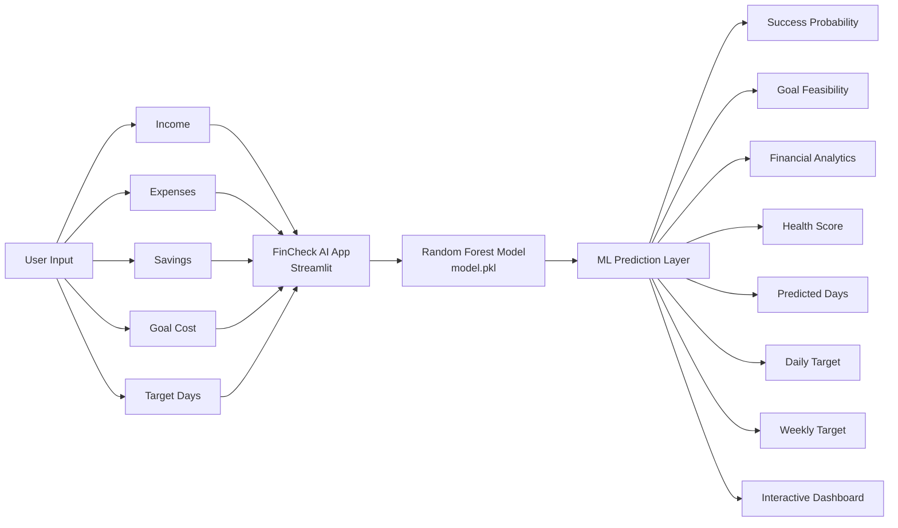

FinCheck AI – Project Overview
=> Problem Statement

Many people struggle to determine whether they can realistically achieve their financial goals, such as buying a laptop, bike, car, house, or planning a vacation. Traditional budgeting tools only track expenses and income but do not provide intelligent predictions or personalized savings plans.

FinCheck AI addresses this problem by using Machine Learning to predict the likelihood of achieving a financial goal and generating actionable daily and weekly savings targets based on a user's financial situation and desired timeline.

=> ML Approach
Machine Learning Algorithm : Random Forest Classifier

Input Features
* Monthly Income
* Monthly Expenses
* Current Savings
* Goal Cost

Target Variable
Success (1 = Goal Achievable, 0 = Goal Not Achievable)

=> Working
1. User enters financial information.
2. Trained Random Forest model analyzes the inputs.
3. Model predicts:
   Success Probability
   Goal Achievement Feasibility
4. Additional financial calculations generate:
    Financial Health Score
    Predicted Days Required
    Daily Savings Target
    Weekly Savings Target

=> Dataset Description
  Dataset Type: Synthetic Financial Dataset
  Dataset Size: 5,000 Records

=> Features: 
| Feature   | Description             |
| --------- | ----------------------- |
| income    | Monthly income of user  |
| expenses  | Monthly expenses        |
| savings   | Current savings amount  |
| goal_cost | Cost of desired goal    |
| success   | Goal achievement status |

=> Sample Record:
| Income | Expenses | Savings | Goal Cost | Success |
| ------ | -------- | ------- | --------- | ------- |
| 50000  | 30000    | 10000   | 40000     | 1       |
| 25000  | 22000    | 2000    | 60000     | 0       |

=> Dataset Generation Logic

Success = 1
if

Savings + (Income - Expenses) × 6
≥ Goal Cost

=> Model Performance
Algorithm Used: Random Forest Classifier

=> Performance Metrics
| Metric    | Value |
| --------- | ----- |
| Accuracy  | ~95%  |
| Precision | ~94%  |
| Recall    | ~95%  |
| F1 Score  | ~94%  |

=> Why Random Forest?
* High prediction accuracy
* Handles non-linear relationships
* Robust against overfitting
* Fast training and prediction

=>Key Features
* Financial Health Score
* Success Probability Prediction
* Daily Savings Target
* Weekly Savings Target
* Goal Feasibility Analysis
* Dream Achievement Prediction
* Interactive Dashboard
* Machine Learning Based Insights
* Public Web Application

=>Architecture Flow Diagram
## Architecture Flow

=> Project Description 
FinCheck AI is a Machine Learning-powered financial planning platform that predicts a user's likelihood of achieving financial goals and generates personalized savings plans. Using a Random Forest Classifier trained on 5,000 financial scenarios, the system analyzes income, expenses, savings, and goal cost to provide success probability, financial health insights, and actionable daily and weekly savings recommendations.
